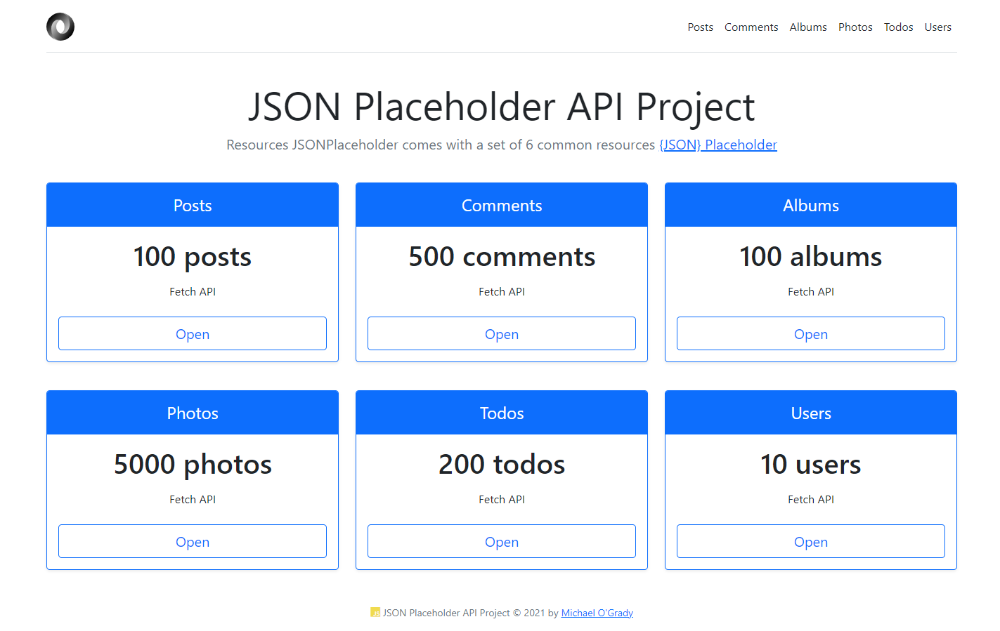

# JSON REST API Projects with AJAX

This series is a collection of JSON REST API Projects.
Explore the Projects using the Website Portal below and use back to return to the home screen.

> JSON ~ JavasScript Object Notation - Lightweight data-interchange format replaces old school XML.
> Used to send data back and forth to a server as text.
> Based on JavaScript object literals - subset of JavaScript.
> Easy to understand and write and is often used with AJAX - Asynchronous JavaScript And XML.
> Can be parsed with any modern programming language.

### Data types used with JSON - Values need to fit into these

1. Number: No difference between integers/floats etc.
2. String: String of Unicode Characters. Use double quotes.
3. Boolean: True or false/
4. Array: Ordered list of 0 or more values.
5. Object: Unordered collection of key/value pairs
6. Null: Empty value.

### JSON Syntax Rules

1. Uses key/value pairs - {"name:":"Michael"}
2. uses double quotes around KEY and VALUE
3. Must use the specified data types
4. File type is ".json"
5. MIME type is "Application/json"

### JSON Example

- https://jsonplaceholder.typicode.com/photos

```json
[
  {
    "albumId": 1,
    "id": 1,
    "title": "accusamus beatae ad facilis cum similique qui sunt",
    "url": "https://via.placeholder.com/600/92c952",
    "thumbnailUrl": "https://via.placeholder.com/150/92c952"
  }
]
```

<h1 align="center">


</h1>

> HTML, CSS, JavaScript, jQuery.

<p align="center">

<a href="https://mogrady-professional.github.io/JSON-REST-API-Projects-with-AJAX/index.html"></a>

  </p>
